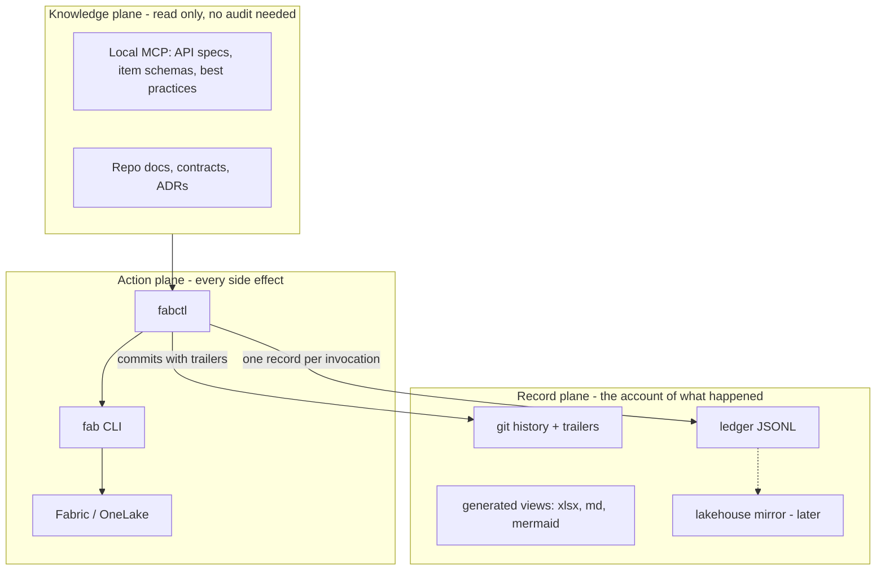

# Fabric Agent Framework

A framework for autonomous and semi-autonomous agents to author, review, sync, document
and audit Microsoft Fabric artifacts.

Status: **design finalised.** Nothing is built yet; phase 0 settles the open assumptions in
section 6 before phase 1 begins.
Last updated: 2026-09-15.

---

## 0. The finding that changes the plan

The premise for this session was: *Claude Code can't OAuth to the Fabric Core MCP server
because Dynamic Client Registration is disabled at tenant level, so execution has to move
to VS Code + GitHub Copilot.*

The DCR half is correct and has no workaround — pre-configuring `oauth.clientId` in
`.mcp.json` does not help, Claude Code still attempts DCR (anthropics/claude-code
[#38102](https://github.com/anthropics/claude-code/issues/38102),
[#26675](https://github.com/anthropics/claude-code/issues/26675),
[#67258](https://github.com/anthropics/claude-code/issues/67258), all open).

The conclusion does not follow. **Microsoft ships a first-party CLI — `fab`
([microsoft/fabric-cli](https://github.com/microsoft/fabric-cli), GA at v1.5) — that
covers more of Fabric than either MCP server and needs no MCP, no DCR, and no service
principal to get started.**

```bash
pip install ms-fabric-cli
```

Then `fab auth login` (interactive browser, once; token cached). Python 3.10–3.13 is
required; this machine has 3.11.4.

That single change means execution does **not** have to leave Claude Code. The handoff to
Copilot becomes optional rather than forced.

### Capability comparison

| Capability | Core MCP | Local MCP | `fab` CLI |
|---|:---:|:---:|:---:|
| Workspace / item CRUD | yes | create only | yes |
| Get / update item definition | yes | — | yes (`import`/`export`/`api`) |
| **Git connect / status / commit / update** | **no** | **no** | **yes** (via `fab api`) |
| **Notebook & pipeline execution** | **no** | **no** | **yes** (`fab job run`) |
| OneLake file read/write | no | yes | yes (`cp`, `-A storage`) |
| Table query | no | yes | yes (`fab table`) |
| Offline API specs + item JSON schemas + best practices | no | **yes** | no |
| Service principal / OIDC auth | via host | via host | yes (native) |
| Reachable from Claude Code today | **no (DCR)** | yes (stdio) | **yes** |
| Reachable from CI | no | no | **yes** |
| Per-turn context cost | ~30 tool schemas, every turn | tool schemas, every turn | ~0 until skill loads |

Two consequences, stated without hedging:

1. **Core MCP is not used at all.** Not for writes, not for reads, not for traversal or
   exploration. It is removed from `.mcp.json` and no skill references it. Everything it
   does, `fab` does, and `fab` does considerably more.
2. **Local MCP is used, for knowledge only.** Never for actions — its OneLake write tools
   are denied by hook. What it is kept for is the one thing no CLI provides: bundled
   OpenAPI specs, per-item-type JSON schemas, and Microsoft's best practices, offline, at
   authoring time. That is how an agent writes a correct `.platform` and item definition
   from scratch instead of guessing and failing a sync.

### Why even reads don't go to Core MCP

An earlier draft of this design kept Core MCP "for reads and exploration inside Copilot —
free, ergonomic, zero build." That is discarded; reads use `fab` like everything else. The
ergonomics argument is real but it loses to four others:

- **MCP costs tokens twice.** ~30 tool schemas ride in *every* request of every Copilot
  session, including sessions that never touch Fabric — and MCP tool results are verbose by
  default. `fab api workspaces -q "value[?type=='Lakehouse'].{n:displayName,id:id}"`
  filters server-side and returns three fields; `list_items` returns everything about
  everything. Given that token cost is the stated priority, a permanent tax for occasional
  convenience is the wrong trade.
- **A split read path breaks skill portability.** A skill step that says "call
  `list_workspaces`" runs only in Copilot. Either every read is written twice, or it is
  written against `fab` anyway — in which case the MCP path earns nothing.
- **Reads are the evidence for the writes.** This is the argument that actually settles it.
  An agent reads to resolve an item ID, then writes using it. If the read came from MCP and
  the write from `fabctl`, the ledger records the mutation but not what the agent *saw* when
  it decided. Routing reads through `fabctl` lets the run context capture the resolved IDs
  and the listing the decision rested on — so an auditor can ask not just "what changed"
  but "on what basis". Reads are not audit-neutral.
- **Two ways to do one thing invites drift.** An agent holding both will sometimes reach for
  an MCP tool where `fabctl` was required. The `PreToolUse` deny hook catches it, but the
  cleanest guard is not offering the second path at all.

**Practical note on Local MCP:** it too pays the per-turn schema cost, and it ships OneLake
*write* tools that this design forbids. Run it in the narrowest `--mode` that still serves
schemas and specs, enable it in sessions where new item types are being authored rather
than always-on, and let the `PreToolUse` deny hook cover its write tools.

---

## 1. Design decisions taken

| # | Decision | Rationale |
|---|---|---|
| D1 | `fab` CLI is the execution engine; `fabctl` is a thin auditing wrapper over it | CLI-first for token cost; upfront build is reusable; a wrapper is the only interceptable chokepoint |
| D2 | Local MCP for knowledge only; Core MCP not used at all, reads included in that | Skills stay portable; reads are the evidence for the writes and belong on the audited path |
| D3 | Repo is upstream of Fabric; `updateFromGit` is the normal direction | Human review happens *before* change reaches Fabric, not after |
| D4 | Notebooks by default; Spark Job Definition requires an ADR | Notebooks serialize to plain `.py` in git — reviewable, greppable, agent-editable |
| D5 | Variable Library is the config mechanism | First-class Fabric item, git-serialized JSON, per-environment value sets, readable from notebooks |
| D6 | YAML canonical for contracts; `.md` and `.xlsx` are generated views | Diffable, schema-validatable, machine-appliable |
| D7 | Mapping history lives in git history + tags, not one file per version | Preserves the PR diff, which is the entire point of PR review |
| D8 | Ledger is date-partitioned, hash-chained JSONL in the repo | Append-only diffs, minimal merge conflicts, tamper-evident |
| D9 | Direct commit + auto-sync in dev; PR gate above dev | Fast inner loop, real gate before anything shared |
| D10 | All git operations are plain `git`; only PR create/query is platform-adapted | VCS-agnostic requirement — GitHub now, Azure DevOps later, one file changes |
| D11 | Agent hooks enforce the invariant; skills only document it | A rule an agent is asked to follow fails silently; a `PreToolUse` deny cannot be forgotten |
| D12 | Fabric's own serialization is the canonical file format, derived via `fab export` | Don't fight the serializer — adopt it, and the round-trip diff goes empty by construction |

---

## 2. Architecture

Three planes. The separation is what makes auditing tractable.



### The invariant

> Nothing mutates Fabric except through `fabctl`.
> Nothing mutates the repo except through `git`.
> Every `fabctl` invocation appends exactly one ledger record.
>
> Therefore **repo history + ledger = a complete account of every agent action.**

This is why `fabctl` exists at all, and why MCP mutations are forbidden: an MCP tool call
goes agent → Fabric directly. Fabric logs it in *Microsoft's* audit log; your ledger never
sees it. An MCP-only design makes the audit requirement unsatisfiable. That, not token
cost, is the deciding argument.

### The write path — direct CLI vs. git-then-sync

There are two ways to change an item, and choosing per-task is how workspaces drift:

- **Direct.** `fabctl item import` writes the definition straight into the workspace. Fast,
  no git, no long-running operation.
- **Git-then-sync.** Edit the file in the repo → commit → push → `fabctl sync push` →
  `updateFromGit` → workspace. Slower, reviewable, recorded.

They are not competing options to weigh each time. **They belong to different lifecycle
stages, and the discriminator is mechanical: whether the target workspace is git-connected.**

> A git-connected workspace has exactly one writer, and that writer is git.

Write directly into a git-connected workspace and Fabric immediately reports an uncommitted
change in `git/status`. The next `updateFromGit` then either conflicts or silently reverts
the work. So a direct definition write to a connected workspace isn't a shortcut — it plants
a defect that someone has to reconcile later. Forbid it mechanically rather than by
convention.

| Workspace | Git-connected | Who may write definitions | Path |
|---|---|---|---|
| `ws_scratch_<user>` | **no** | anyone, directly | Direct — fast loop, throwaway |
| `ws_dev` | yes | git only | Git-then-sync, no PR |
| `ws_test`, `ws_prod` | yes | git only | Git-then-sync, PR-gated |

#### Verb classes — how `fabctl` enforces this in code

Every `fabctl` verb carries one of four classes. The class, crossed with the target
workspace's git-connection state, decides allow or refuse. No judgement, no agent
discretion.

| Class | Examples | Audited | Allowed on a git-connected workspace |
|---|---|---|---|
| `READ` | `ls`, `get`, `status`, `verify` | no | yes |
| `EXECUTE` | `job run`, table + data writes | yes | **yes** — changes data, not definition |
| `DEFINITION` | `item import`, create, delete, rename | yes | **no** — refuse, point at the git path |
| `SYNC` | `sync push`, `sync pull`, `connect` | yes | yes — the only door definitions come through |

`EXECUTE` is deliberately allowed everywhere: running a notebook mutates *data*, produces no
git diff, and is exactly what you need after a sync. Reads are unaudited by design — the
ledger records actions, and a read that informed an action is captured in that action's run
context rather than as a record of its own.

Before any `DEFINITION` verb, `fabctl` resolves
`GET /workspaces/{id}/git/connection` (cached per session) and refuses if connected:

```
✗ ws_dev is git-connected. Direct definition writes create drift Fabric will flag.
  → edit fabric/nb_silver_customers.Notebook/notebook-content.py
  → fabctl commit && fabctl sync push --env dev
  (or iterate in ws_scratch_haotian, then `fabctl promote --from scratch`)
```

#### Bootstrapping, and the fast loop

**Creating an item that doesn't exist yet** goes repo-first: hand-author `.platform` and the
definition files in `fabric/`, commit, `sync push`. Fabric creates the item. This is the
single strongest reason Local MCP earns its place — its per-item-type JSON schemas are what
make writing a correct definition from scratch feasible instead of guesswork.

**When the fast loop is genuinely needed** — "does this Spark code even run" — use the
scratch workspace, then graduate:

```
fab export <item> -o ./scratch-export/   # Fabric's own serialization
fabctl normalise ./scratch-export/       # canonical form
→ copy into fabric/, commit, PR, sync push --env dev
```

Note this is the same `fab export` step the normaliser calibrates against, so one mechanism
serves both purposes.

Be honest about the cost: git-then-sync adds a commit, a push, and a long-running operation
poll to every iteration. That latency is the price of the audit trail, and the scratch
workspace exists so you don't pay it while still exploring. Profiles must therefore declare
a scratch workspace, not just the environment chain.

### Enforcement — making the invariant true, not merely stated

An invariant an agent is *asked* to honour fails silently. Both agent surfaces expose
lifecycle hooks that make it enforceable in code, and — the useful accident — **VS Code
Copilot reads `.claude/settings.json` natively**, so one committed config governs both.

| | Claude Code | VS Code Copilot |
|---|---|---|
| Events | `PreToolUse`, `PostToolUse`, `PostToolUseFailure`, `SessionStart`, `Stop`, + ~25 more | `PreToolUse`, `PostToolUse`, `SessionStart`, `UserPromptSubmit`, `Stop`, `PreCompact`, `SubagentStart/Stop` |
| Config | `.claude/settings.json` (committed) | `.github/hooks/*.json` **or `.claude/settings.json`** |
| stdin payload | `tool_name`, `tool_input`, `tool_response`, `session_id`, `cwd`, `tool_use_id` | `tool_name`, `tool_input`, `session_id`, `cwd`, `timestamp`, `transcript_path` |
| Can block? | yes — exit 2, or `permissionDecision: "deny"` | yes — `hookSpecificOutput.permissionDecision: allow/deny/ask` |
| Status | stable | **preview**; needs `chat.useCustomAgentHooks: true` |

Four hooks carry the whole enforcement story:

```jsonc
// .claude/settings.json  — read by BOTH agents
{
  "hooks": {
    // 1. Refuse MCP mutations outright. The invariant becomes unbypassable,
    //    not a rule the agent is trusted to remember.
    "PreToolUse": [
      { "matcher": "mcp__.*__(create|update|delete|upload|write|move|rename).*",
        "hooks": [{ "type": "command",
                    "command": "${CLAUDE_PROJECT_DIR}/tools/fabctl/hooks/deny_mcp_mutation.py" }] },

    // 2. Catch raw `fab` calls that bypass fabctl.
      { "matcher": "Bash|PowerShell",
        "hooks": [{ "type": "command",
                    "command": "${CLAUDE_PROJECT_DIR}/tools/fabctl/hooks/guard_raw_fab.py" }] }
    ],

    // 3. Backstop ledger: record any MCP call that did get through.
    "PostToolUse": [
      { "matcher": "mcp__.*",
        "hooks": [{ "type": "command",
                    "command": "${CLAUDE_PROJECT_DIR}/tools/fabctl/hooks/ledger_append.py" }] }
    ],

    // 4. Verify the hash chain at the end of every turn, and run preflight at start.
    "Stop":         [{ "hooks": [{ "type": "command", "command": "fabctl ledger verify --quiet" }] }],
    "SessionStart": [{ "hooks": [{ "type": "command", "command": "fabctl preflight --brief" }] }]
  }
}
```

Two honest limits on this:

- Copilot's `PostToolUse` payload does **not** document `tool_response`, and it has no
  `PostToolUseFailure`. So on that surface a backstop record captures *intent* but may not
  capture *outcome*. This is tolerable because hooks are a backstop — `fabctl` writes the
  authoritative record on the sanctioned path, with diff and undo that a hook could never
  reconstruct. Copilot hook coverage of MCP tools specifically is also undocumented; if it
  proves incomplete, wrap the stdio Local MCP server in a JSON-RPC passthrough proxy that
  logs every `tools/call`. That is host-independent and about 80 lines.
- `.claude/settings.json` lives in the repo, so an agent could edit its own hooks. Put it
  under CODEOWNERS with human review required, and have CI assert the hook config matches
  the expected digest. This raises the cost of deliberate bypass and eliminates *accidental*
  bypass entirely — but see the tamper-evidence limit in Layer 5, which it narrows rather
  than closes.

### Reconciliation — proving nothing was missed

Hooks and `fabctl` record what *we* saw. The [Get Activity Events
API](https://learn.microsoft.com/en-us/rest/api/power-bi/admin/get-activity-events) returns
what *Fabric* saw. Diffing them turns "we hope everything was logged" into "we can show
what wasn't" — which is what an auditor actually wants.

```
fabctl ledger reconcile --date 2026-09-15
  → Fabric activity events for the tenant
  → left-joined against ledger/2026/09/15.jsonl
  → report: matched / ledger-only / FABRIC-ONLY (= unlogged action, investigate)
```

Constraints that shape the design: requires Fabric admin or a service principal, 28-day
retention, one day per request, 200 requests/hour. So it is a **daily** scheduled job, and
it lands in phase 7 with the SP. Design for it now, run it later.

---

## 3. Repository layout

```
<repo-root>/
├─ AGENTS.md                       # constitution; entry point for ALL agents
├─ CLAUDE.md                       # 3-line pointer to AGENTS.md
├─ .github/
│  ├─ copilot-instructions.md      # 3-line pointer to AGENTS.md
│  └─ instructions/*.instructions.md   # generated shims with applyTo globs
├─ .claude/skills/<skill>/SKILL.md # canonical skill bodies
│
├─ fabric/                         # Fabric git integration directoryName points HERE
│  ├─ nb_bronze_to_silver_retail.Notebook/
│  │  ├─ .platform                 # version, config.logicalId, metadata.type/displayName
│  │  └─ notebook-content.py
│  ├─ lh_silver_retail_curated.Lakehouse/
│  ├─ vl_retail_config.VariableLibrary/
│  │  ├─ variables.json
│  │  └─ valueSets/{dev,test,prod}.json
│  └─ ...
│
├─ contracts/                      # the parameterised data architecture
│  ├─ entities/<layer>/<entity>.entity.yaml
│  ├─ mappings/<layer>/<entity>.map.yaml
│  ├─ mappings/<layer>/<entity>.history.md
│  └─ schema/*.json                # JSON Schema validating the above
│
├─ docs/
│  ├─ architecture/*.md            # mermaid inline
│  ├─ dictionary/                  # GENERATED from contracts
│  └─ adr/NNNN-<slug>.md
│
├─ ledger/
│  ├─ schema.json
│  └─ YYYY/MM/DD.jsonl
│
├─ profiles/{poc,project,enterprise}.yaml
│
└─ tools/
   ├─ fabctl/                      # the wrapper + vcs adapters
   └─ render/                      # xlsx / md / mermaid generators
```

**Why `fabric/` is isolated:** Fabric's git integration manages exactly the directory
given as `directoryName` at connect time. Everything else is invisible to Fabric, so
`updateFromGit` cannot clobber the framework and the framework cannot confuse Fabric.

> **Load-bearing assumption — verify on first connect.** Confirm empirically that Fabric
> leaves sibling directories untouched before trusting any framework file to survive an
> `updateFromGit`. Test with a throwaway file first.

### Dual-agent addressing

One canonical skill body, two thin shims — no duplicated prose, no drift:

| Agent | Reads | Contains |
|---|---|---|
| Claude Code | `.claude/skills/<n>/SKILL.md` | canonical body |
| Copilot | `.github/instructions/<n>.instructions.md` | frontmatter `applyTo` glob + one line: *"Follow `.claude/skills/<n>/SKILL.md`"* |
| Both | `AGENTS.md` | the invariant, the gates, the profile in force |

Shims are generated by `fabctl skills sync`, and CI fails if they are stale.

---

## 4. The skills

13 skills in six layers. Each declares: trigger, inputs, outputs, gate, ledger action.

### Layer 1 — Resource & lifecycle

**`fabric-resource-map`** — workspace and folder organisation, naming conventions, and the
topology profile system. Resolves "which workspace am I acting on" from the profile rather
than from hardcoded IDs.

Naming: `{prefix}_{domain}_{grain}` — `lh_bronze_retail_raw`, `nb_silver_customers`,
`vl_retail_config`. Fabric folder names are forced to `{displayName}.{Type}`, so the
display name *is* the path; treat renames as breaking changes.

Topology is data, not code:

```yaml
# profiles/project.yaml
name: project
vcs: github                # github | azuredevops - the ONLY platform-coupled key
scratch:
  workspace: "Retail Scratch ${USER}"
  git_connected: false     # the fast loop lives here; direct writes permitted
  ttl_days: 7              # reaped by fabctl, never promoted from without export
environments:
  - id: dev
    workspace: "Retail Analytics Dev"
    branch: dev
    value_set: dev
    gate: none             # direct commit, auto-sync
  - id: test
    workspace: "Retail Analytics Test"
    branch: test
    value_set: test
    gate: pull_request
  - id: prod
    workspace: "Retail Analytics Prod"
    branch: main
    value_set: prod
    gate: pull_request
    require_checks: [reconcile-test, contract-drift]
```

`poc.yaml` is dev→prod. `enterprise.yaml` adds per-feature workspaces. Switching profile
is a one-line change and every skill adapts.

**`fabric-sync`** — the git↔Fabric sync contract.

```bash
fabctl sync status   --env dev     # -> fab api workspaces/{id}/git/status
fabctl sync push     --env dev     # -> updateFromGit  (repo -> Fabric, THE NORMAL DIRECTION)
fabctl sync pull     --env dev     # -> commitToGit    (Fabric -> repo, EXCEPTIONAL)
fabctl sync connect  --env dev     # -> connect + initializeConnection
```

Rules:

- `push` is normal. `pull` is only for reconciling hand-edits made in the Fabric portal,
  and it must land on a branch and go through a PR like anything else.
- Never `pull` above dev. If prod drifted, that is an incident, not a sync.
- All four are long-running operations: capture `x-ms-operation-id`, poll
  `fab api operations/{id}`, honour `Retry-After`.
- On `Items with conflicting logical IDs`, stop and escalate. Never auto-resolve by
  editing a `logicalId`.

**`git-workflow`** — branch model, commit format, gates, tags.

Branches: `feature/<slug>` → `dev` → `test` → `main`. Environment branches are long-lived
and each is bound to exactly one workspace.

Every agent commit carries trailers, which is what makes git itself queryable:

```
feat(silver): apply customers mapping v1.1

Agent-Run-Id: 018f2a...
Agent-Model: claude-opus-5
Agent-Surface: claude-code
Contract: contracts/mappings/silver/customers.map.yaml@1.1
Ledger-Ref: ledger/2026/09/15.jsonl#018f2a...
Human-Approver: haotian.qu@deeeplabs.com
Co-Authored-By: Claude Opus 5 <noreply@anthropic.com>
```

`git log --format='%(trailers:key=Agent-Run-Id,valueonly)'` enumerates every agent action
straight from git, with no extra tooling — and it works identically on GitHub and Azure
DevOps.

Tags: `map/<entity>/v<version>` on the merge commit that adopted a mapping version.

### Layer 2 — Code

**`notebook-authoring`** — the notebook standard.

*Decision D4, justified:* a Fabric Notebook serializes to `notebook-content.py` — literally
Python in git, with cells delimited by marker comments and metadata in a header block. An
agent can edit it with ordinary text tools, a reviewer reads a normal diff, and `grep`
works. A Spark Job Definition splits its payload across a definition file and a separately
referenced main file, which is more moving parts for no gain in an ELT context. Notebooks
are *not* interactive-only — `fab job run`, schedules and pipelines all drive them.

Use a Spark Job Definition only when you need a packaged wheel/jar entry point, custom JVM
or spark-submit configuration a notebook cannot express, or a CI-built artifact. Write an
ADR first.

Notebook structure (enforced by a lint check):

```python
# CELL - header:  purpose, contract ref, owner, generated-or-authored
# CELL - config:  vl = notebookutils.variableLibrary.getVariables("vl_retail_config")
# CELL - params:  a single parameters cell, no literals elsewhere

# >>> GENERATED FROM contracts/mappings/silver/customers.map.yaml v1.1 sha256:abc123
#     DO NOT EDIT BY HAND - regenerate with: fabctl mapping apply silver.customers
# CELL - generated transformation
# <<< END GENERATED

# CELL - hand-authored business logic (safe from regeneration)
# CELL - contract assertions
```

The sentinel region is the mechanism that lets agents regenerate mapping code without
destroying human-written logic. CI re-renders the contract and fails if the region drifted.

#### Normalisation — the formatting problem, solved by adopting Fabric's format

Two distinct problems hide under "formatting", and they need different answers.

**Agent-to-agent nondeterminism.** Claude and Copilot will emit different whitespace, cell
ordering and metadata for identical logical content. Fully solvable, and worth solving
regardless: a pre-commit normaliser makes byte output a function of content, not of which
agent wrote it. Note the general principle — *a skill that states a format is a soft
constraint; a hook that enforces it is a hard one.* Prefer the hook, and let the skill
document what the hook enforces.

**Fabric's serializer.** A hook cannot change what Fabric writes. So do not fight it —
**adopt Fabric's output as the canonical form.** Derive the normaliser's rules from what
Fabric actually emits, so that repo form and Fabric form are identical and `commitToGit`
produces an empty diff.

This reframes the round-trip test from a go/no-go gate into a **calibration procedure**,
and `fab export` is Fabric's own serializer available as an oracle:

```
1. fabctl sync push --env dev          # our form  → Fabric
2. fab export <notebook> -o ./oracle/  # Fabric's form → disk
3. diff ./oracle/ ./fabric/            # every difference is a normaliser rule
4. encode the rules, re-run until the diff is empty
```

The result is a normaliser correct by construction rather than by guesswork, and the same
three commands become a CI job — so if Microsoft changes the serializer, CI reports it the
day it happens rather than as mysterious diff noise weeks later.

Scope it beyond notebooks: `.platform` (JSON key order), `variables.json`,
`valueSets/*.json`, and contract YAML are the same problem class. One normaliser, several
file types.

#### The normaliser is code, not an instruction

This is worth stating explicitly because it is the difference between a rule that holds and
one that mostly holds. `tools/render/normalise.py` is a deterministic, pure-Python
transformation: bytes in, bytes out, no model in the loop, no interpretation. It is unit
tested with fixtures, and its correctness is checkable by running it twice and comparing.

An agent's only permitted interaction with it is to *run* it. No skill says "format the
notebook like this" — the skill says "run `fabctl normalise`", and the hook runs it anyway
if the agent forgets. Anything an agent could paraphrase, it will eventually paraphrase
wrong; anything a script does, it does identically every time. The same principle already
governs the `xlsx-render` determinism rules and the ledger hash chain.

> **A git hook alone is not enough.** `.git/hooks/` is not committed, does not survive a
> clone, is skipped by `--no-verify`, and never runs in CI. Drive it with the `pre-commit`
> framework so one `.pre-commit-config.yaml` serves both the local hook and a CI job that
> re-normalises and fails on mismatch. Local hook for speed, CI check for truth. And because
> `fabctl init` installs the hook, `preflight` should report when it is missing.

**`config-and-secrets`** — Variable Library as the config mechanism.

Config never lives in notebook literals or a stray `config.json`. It lives in a Variable
Library item, which git-serializes as `variables.json` plus `valueSets/<env>.json`, and is
read at runtime by `notebookutils`. Promotion between environments changes the value set,
not the code — which is exactly the property you want when the same notebook must run in
dev, test and prod.

Never in git: SP secrets, connection strings, PATs, SAS tokens, data extracts. Secrets go
to Key Vault and are referenced. A pre-commit secret scan enforces this.

### Layer 3 — Contracts (the parameterised data architecture)

A human-reviewed mapping that a standardised skill applies to the lakehouse.

**`data-contract`** — authoring and versioning entity + mapping YAML.

```yaml
# contracts/mappings/silver/customers.map.yaml
version: "1.1"
target: {layer: silver, entity: customers, lakehouse: lh_silver_retail_curated}
sources:
  - {layer: bronze, table: raw_crm_customers, alias: c}
grain: one row per customer
strategy: merge
keys: {natural: [c.crm_customer_id], surrogate: customer_key}
columns:
  - target: customer_id
    source: c.crm_customer_id
    type: string
    nullable: false
    transform: trim
  - target: email
    source: c.email_addr
    type: string
    nullable: true
    transform: lower(trim(x))
    pii: true
    masking: hash_sha256
quality:
  - {rule: unique, columns: [customer_id], on_fail: quarantine}
  - {rule: not_null, columns: [customer_id, signup_date], on_fail: quarantine}
provenance:
  approved_by: haotian.qu@deeeplabs.com
  pr: "<url>"
```

Every file is validated against `contracts/schema/mapping.schema.json` in CI, so a
malformed contract can never reach the apply step.

#### Versioning (D7) — the justification you asked for

Only the **current** version exists as a file. History lives in git history, plus an
annotated tag per version and a small changelog per entity.

The alternative — one file per version, `v1.0.yaml`, `v1.1.yaml` — destroys the PR diff.
Adding a file shows as a wall of green: a reviewer sees 200 added lines, not the three
columns that actually changed. Since the whole reason for PR-gating mappings is that a
human reads the change, that model defeats its own purpose. The chosen model shows
`- cust_id` / `+ customer_id`, which is what review needs.

The cost is that an agent cannot glob for old versions. Two cheap additions close that gap
without duplicating content:

```markdown
<!-- contracts/mappings/silver/customers.history.md -->
| Version | Date | Commit | PR | Change | Approver | xlsx sha256 |
|---|---|---|---|---|---|---|
| 1.1 | 2026-09-15 | `a1b2c3d` | #42 | rename cust_id to customer_id; add consent_flag | haotian.qu | `9f86d0...` |
| 1.0 | 2026-09-01 | `d4e5f6a` | #17 | initial | haotian.qu | `2c26b4...` |
```

An agent reads the changelog, gets the tag, and runs
`git show map/customers/v1.0:contracts/mappings/silver/customers.map.yaml`. Deterministic
forever, zero duplication.

> **Caveat:** any CI job rendering a historical version needs `fetchDepth: 0` **and** tags
> fetched. On a shallow clone `git show <tag>` fails.

**`mapping-apply`** — turn an approved mapping into lakehouse reality.


`plan` never mutates. `apply` above dev requires `--apply` plus a merged PR. Every stage
emits a ledger record.

**`xlsx-render`** — deterministic, versioned, never committed.

| Requirement | Mechanism |
|---|---|
| Versioned 1.0 / 1.1, not updated on the fly | Rendered from a tag, never from the working tree |
| Not stored in git | `*.xlsx` in `.gitignore`; written to `out/` |
| Generated on demand | `fabctl mapping xlsx silver.customers --version 1.1` |
| **Layout stability** between versions | Fixed sheet set and order; fixed column order; rows sorted by `(target_table, ordinal, target_column)`; one row per column; never merged cells |
| **Byte determinism** | Pinned `openpyxl==3.1.2`; all zip member timestamps fixed to a constant derived from the version tag's commit date, not `now`; fixed workbook creator/created/modified; no "generated at" cell — provenance is version + commit sha instead |

These are two different requirements and both are needed. Layout stability means a human
diffing v1.0 against v1.1 sees only real changes. Byte determinism means regenerating v1.0
twice gives identical bytes — without it, the `sha256` recorded in the changelog is
meaningless. The sha is then a reproducible-build check: if a regenerated v1.0 does not
match, either the renderer changed or history was altered.

### Layer 4 — Documentation

**`tech-docs`** — dictionary, architecture, mermaid, ADRs.

| Artifact | Canonical | Generated | Why |
|---|---|---|---|
| Data mapping | YAML | `.md`, `.xlsx` | diffable, validatable, appliable |
| Data dictionary | derived from `entities/*.yaml` | `.md`, `.xlsx` | never hand-maintained, so never stale |
| Architecture | `.md` + inline mermaid | optional `.svg` | mermaid renders natively in both GitHub and Azure DevOps; diffs as text |
| ADR | `.md` | — | prose, human-authored |
| Ledger | JSONL | Delta, `.md` digest | one record per line |

Every generated file carries a header: `<!-- GENERATED from <source>@<version> - do not
edit -->`. CI regenerates and fails on drift, so a generated doc cannot silently rot.

Mermaid conventions: `erDiagram` for models, `flowchart LR` for lineage, `sequenceDiagram`
for agent workflows. Keep node labels short — long labels break layout on both renderers.

ADRs record *why*. The ledger records *what*. Auditing an autonomous system needs both:
without ADRs you can replay every action and still have no idea whether the decisions were
sound.

### Layer 5 — Audit & verification

**`audit-ledger`**

`ledger/YYYY/MM/DD.jsonl`, one JSON object per line, append-only, hash-chained:

```json
{"ts":"2026-09-15T04:12:33.212Z","run_id":"018f2a","seq":4,
 "prev":"sha256:7d3f",
 "actor":{"type":"agent","model":"claude-opus-5","surface":"claude-code",
          "principal":"haotian.qu@deeeplabs.com"},
 "intent":"apply mapping silver.customers v1.1",
 "action":"fabric.item.update_definition",
 "target":{"env":"dev","workspace_id":"e11a0c22","item":"nb_silver_customers",
           "item_id":"8c89aefb","type":"Notebook"},
 "repo":{"branch":"dev","commit":"a1b2c3d","dirty":false},
 "contract":"contracts/mappings/silver/customers.map.yaml@1.1",
 "command":"fab api workspaces/.../items/.../updateDefinition -X post -i ...",
 "result":{"status":"succeeded","operation_id":"...","duration_ms":4211},
 "diff_digest":"sha256:5e88",
 "undo":{"prior_definition_digest":"sha256:aa31","prior_commit":"f0e9d8c"},
 "approval":{"required":false,"pr":null,"approver":null}}
```

*Why JSONL, not one JSON array:* appending to an array rewrites the whole file — huge git
diffs and a merge conflict every time two agents run. JSONL appends one line: the diff is
one line and concurrent runs rarely collide. Date partitioning reduces collisions further.

Queryable by anyone with repo access, no infrastructure:

```bash
duckdb -c "SELECT actor.model, action, count(*) FROM read_json_auto('ledger/**/*.jsonl') GROUP BY 1,2"
```

Queryable by anyone with only git: `git log --grep='Agent-Run-Id'`.

Queryable in Fabric once the mirror job exists: a scheduled notebook reads `ledger/**` and
merges into `lh_audit.agent_ledger` as Delta, so workspace users get SQL and Power BI over
it. Phase 2.

> **Honest limitation.** A file in a repo the agent can write to is **tamper-evident, not
> tamper-proof.** An agent could rewrite history. Three mitigations, none absolute:
> (a) `prev` hash-chaining — any edit breaks the chain and CI detects it;
> (b) a CI check that no existing ledger line was modified, only appended;
> (c) branch protection with no force-push, so the remote is the real anchor.
> If you need genuine non-repudiation, the ledger must be written by an identity the agent
> does not control — which means the CI-pipeline path and a service principal.

**`data-reconcile`** — judge data correctness and find discrepancies between lifecycle
stages.

```bash
fabctl verify contract silver.customers --env dev   # actual table vs entity YAML
fabctl verify stage    --env dev                    # bronze -> silver -> gold coherence
fabctl verify env      --table silver.customers --from dev --to test
```

- **contract** — column presence, type compatibility, nullability, PII/masking applied.
- **stage** — row-count reconciliation across layers, orphan foreign keys, duplicate
  primary keys, null rate on required columns, freshness/watermark lag.
- **env** — the same table across two environments: schema drift, row-count delta, checksum
  of a stable sample.

Implemented against the SQL endpoint / `fab table` / OneLake, or by running a generated
verification notebook where Spark is needed. Output: markdown report + ledger record +
non-zero exit so CI can gate on it. This is the `require_checks` in the prod profile.

### Layer 6 — Safety

**`preflight`** — capability probe, run before any task:

```
auth:     fab (user haotian.qu@deeeplabs.com) OK   SP no   local-MCP OK   core-MCP no (DCR)
profile:  project      env: dev      workspace: Retail Analytics Dev OK
git:      branch dev, clean, remote reachable OK
gates:    dev = none
blocked:  sync push (workspace not git-connected - run `fabctl sync connect --env dev`)
```

Emits a capability matrix and refuses to start work it cannot finish. This is the main
defence against an agent doing half a job and leaving Fabric inconsistent.

**`promote`** — environment promotion honouring profile gates; runs `data-reconcile` on
the source environment before opening the PR.

Cross-cutting safety rules, enforced in `fabctl` rather than left to agent judgement:

- **Dry-run by default above dev.** `--apply` is required to mutate anything outside dev.
- **Blast-radius cap.** Refuse a run touching more than N items (default 10) without
  explicit human confirmation. Cheap insurance against a runaway loop.
- **Reversibility.** Every mutating action records `undo`, enabling
  `fabctl rollback <run-id>`.
- **Secret scan** on pre-commit — Fabric connection strings and SP secrets leak into
  notebooks easily.

---

## 5. What gets built, in order

| Phase | Deliverable | Unblocks | Needs SP? |
|---|---|---|---|
| 0 | `pip install ms-fabric-cli`; `fab auth login`; run `preflight` by hand | proves the whole premise | no |
| 1 | `AGENTS.md`, repo skeleton, profiles, `fabctl` core + ledger | every other skill | no |
| 1 | **Agent hooks** in `.claude/settings.json` (deny, guard, backstop, verify) | makes the invariant enforced | no |
| 2 | `fabric-resource-map`, `fabric-sync`, `git-workflow` | repo-to-Fabric loop | no |
| 3 | **Normaliser calibration loop** + `pre-commit` + CI drift check | deterministic notebooks | no |
| 3 | `notebook-authoring`, `config-and-secrets` | code standards | no |
| 4 | `data-contract`, `mapping-apply`, `xlsx-render` | the parameterised architecture | no |
| 5 | `tech-docs`, `audit-ledger` queries | documentation + audit | no |
| 6 | `data-reconcile`, `promote` | multi-env | no |
| 7 | Lakehouse ledger mirror; activity-log reconciliation; CI on ADO; unattended runs | Fabric-side audit, proof of no gaps | **yes** |

Only phase 7 needs the service principal. Everything else can start now.

---

## 6. Confidence — what I have not verified empirically

Everything below is from documentation, not from running it. Ordered by how much damage a
wrong assumption does. All of them are settled by a day of phase-0 work, and I would rather
name them than let the design read as more certain than it is.

| Confidence | Assumption | If wrong |
|---|---|---|
| **~70%** | `fab export` produces byte-identical output to what `commitToGit` writes into the repo | **The weakest link in the whole design.** The normaliser calibrates against `fab export` as an oracle. `export` calls Get Item Definition; `commitToGit` uses Fabric's git serializer. They are probably the same pipeline — but if they differ, calibration must use a real `commitToGit` round-trip on a scratch branch instead, which is slower but still works. Test this first. |
| **~60%** | `fab api` returns the raw 202 + `x-ms-operation-id` and does **not** poll long-running operations for you | If it does poll, `fabctl`'s LRO logic is redundant; if it doesn't and we assume it does, every sync appears to succeed instantly and silently isn't finished. Trivially testable, but it corrupts the ledger's `result` field if we guess wrong. |
| **~80%** | A git-connected workspace **flags** a direct definition write as an uncommitted change, rather than **blocking** it | The design assumes flag-only and enforces the rule in `fabctl`, which is the safe assumption either way. If Fabric actually blocks, our guard is belt-and-braces rather than load-bearing. No redesign either way. |
| **~70%** | VS Code Copilot hooks fire on MCP tool calls | Explicitly undocumented. If they don't, the Copilot-side backstop has a hole and the stdio proxy becomes necessary rather than optional. Does not affect Claude Code. |
| **~85%** | Fabric's `directoryName` leaves sibling directories in the repo untouched | If wrong, the entire repo layout changes — framework files would need a separate repo from `fabric/`. Highest blast radius of anything here; cheapest to test. |
| **~85%** | `fab` has no native git command group, so git integration goes through `fab api` | Only affects how verbose `fabctl sync` is. If native commands exist, they are better. |
| **~85%** | Spark Job Definition splits its payload across a definition file and a separately referenced main file | Load-bearing for decision D4. The docs enumerate notebooks, reports and semantic models but not SJD. If SJD is in fact plain-file-friendly, D4 deserves revisiting. |
| **~85%** | Variable Library values resolve at notebook **runtime** only, not at authoring/generation time | If values were resolvable at generation time, `mapping-apply` could bake environment values into generated code — which would be *worse*, so this assumption failing is a trap to avoid, not a capability to gain. |
| **~60%** | Local MCP's `--mode` flag offers something narrower than `all` that still serves schemas and specs | If not, Local MCP is all-or-nothing and its per-turn schema cost has to be accepted or the server disabled entirely between authoring sessions. |
| **unknown** | `fab` token lifetime and refresh behaviour across long agent sessions | Determines whether a long autonomous run needs a mid-session re-auth, which an unattended agent cannot do interactively. Matters a lot for phase 7. |

Two further concerns that are not factual uncertainties but judgement calls worth flagging:

- **The scratch workspace is a governance hole by construction.** It exists precisely so that
  unreviewed, unaudited direct writes are possible. That is the point — but it means "audited"
  describes the path to dev and above, never the whole system. The TTL reaper and the rule
  that promotion happens only through `fab export` → normalise → PR are what keep it from
  becoming a shadow production environment. Watch for scratch workspaces that stop being
  throwaway.
- **Fourteen skills is a lot to keep coherent.** The real risk is not any single skill but
  their interactions — a change to the verb classes touches `fabric-sync`, `mapping-apply`,
  `promote` and the hooks at once. If phases 1–3 prove the model, consider merging the
  thinner skills before building 4–7 rather than carrying fourteen from the start.

---

## 7. Open risks

1. **Notebook round-trip fidelity — now a calibration task, not a gate.** Fabric may
   reformat `notebook-content.py` on sync. Rather than hoping it doesn't, the normaliser
   (Layer 2) adopts Fabric's own output as canonical, derived from `fab export` as the
   oracle. Residual risk is narrower: that Fabric's serialization is *non-deterministic* or
   *lossy* — e.g. it drops a comment, or emits different output for the same input — in
   which case no normaliser can converge and the sentinel-region drift check needs a
   semantic comparison (parse to cells, compare cell contents) rather than a byte
   comparison. Run the calibration loop early enough to find out.
2. **`directoryName` isolation** is load-bearing and unverified. Test before trusting it.
3. **No service principal yet.** Blocks Azure DevOps git connections (user principals are
   explicitly unsupported for stored ADO connections), unattended CI, and an
   independently-written ledger. Admin ask is in section 8.
4. **Fabric Core MCP is in preview**; its tool list may change. Since no skill depends on
   it, this is contained.
5. **Ledger is tamper-evident, not tamper-proof** (see Layer 5). Hooks narrow this
   materially — accidental bypass becomes impossible, the `Stop` hook verifies the hash
   chain every turn, and reconciliation against Fabric's activity log detects anything
   missing — but the hook config itself lives in the repo the agent can write. Only an
   out-of-process identity (CI plus the service principal) gives genuine non-repudiation.
6. **GitHub to Azure DevOps migration.** Contained to the `vcs:` key in `profiles/*.yaml`
   and one adapter file. Fabric-side cost is a disconnect/reconnect and re-initialize,
   which can surface logical-ID conflicts — do it while the workspace count is small.

---

## 8. What to ask your Fabric/Entra admin

> Requesting a Microsoft Entra service principal for Fabric CI/CD automation:
>
> 1. An app registration with a client secret (or a federated credential for OIDC from CI).
> 2. Tenant setting **"Service principals can use Fabric APIs"** enabled, with the SP in an
>    allowed security group.
> 3. The SP granted **Contributor** (dev/test) and **Member** (prod) on the target Fabric
>    workspaces.
> 4. The SP granted read/write on the Azure DevOps repository — Fabric git connections for
>    Azure DevOps do not support user principals, only service principals.
> 5. Confirmation whether **"Users can create Fabric items"** and workspace-creation
>    restrictions apply to this SP.
>
> Separately, for information: **Dynamic Client Registration** is disabled tenant-wide,
> which is why the Fabric MCP server cannot be used from non-VS-Code MCP hosts. We are not
> requesting a change — the CLI path works without it — but please confirm it is
> intentional so we do not design around a temporary state.

---

## 9. Sources

- [Fabric Core MCP Server tools reference](https://learn.microsoft.com/en-us/rest/api/fabric/articles/mcp-servers/core-remote/tools-core-mcp-server)
- [Fabric MCP Server (local) overview](https://learn.microsoft.com/en-us/rest/api/fabric/articles/mcp-servers/pro-dev-local/overview-local-mcp-server)
- [Automate Git integration by using APIs](https://learn.microsoft.com/en-us/fabric/cicd/git-integration/git-automation)
- [Git integration source code format](https://github.com/MicrosoftDocs/fabric-docs/blob/main/docs/cicd/git-integration/source-code-format.md)
- [Microsoft Fabric CLI](https://github.com/microsoft/fabric-cli) and its [command reference](https://microsoft.github.io/fabric-cli/commands/)
- [Variable libraries overview](https://learn.microsoft.com/en-us/fabric/cicd/variable-library/variable-library-overview)
- [fabric-cicd](https://microsoft.github.io/fabric-cicd/latest/)
- [Notebook source control and deployment](https://learn.microsoft.com/en-us/fabric/data-engineering/notebook-source-control-deployment)
