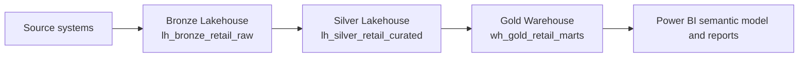
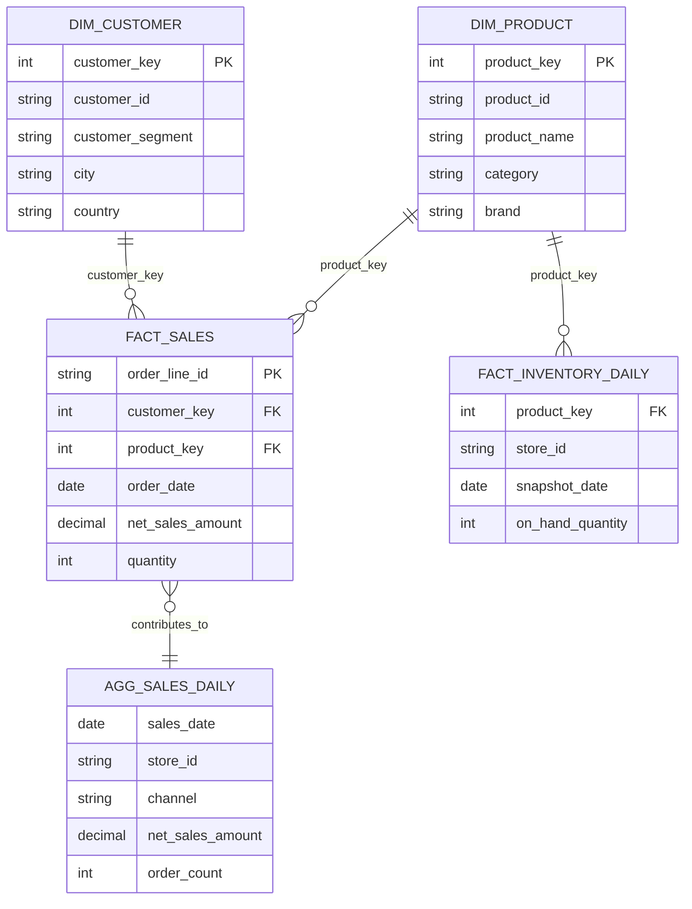

# Example Fabric Medallion Architecture

This design shows a small Microsoft Fabric medallion model using separate Fabric items for each layer. The example domain is retail sales, because it gives simple but realistic entities: customers, products, orders, payments, and inventory.

## Fabric Items

| Layer | Fabric item | Suggested name | Purpose |
|---|---|---|---|
| Bronze | Lakehouse | `lh_bronze_retail_raw` | Raw ingestion landing zone with minimal transformation |
| Silver | Lakehouse | `lh_silver_retail_curated` | Cleaned, conformed Delta tables for analytics and reuse |
| Gold | Warehouse | `wh_gold_retail_marts` | Dimensional marts and KPI-ready serving tables |

Keep these in one Fabric workspace for a simple setup, for example `Retail Analytics Dev`. Use separate workspaces only when you need stronger environment isolation, such as `dev`, `test`, and `prod`.

## Data Source Decision

Use locally generated synthetic retail data for this demo instead of an online dataset.

| Option | Decision | Reason |
|---|---|---|
| Online public dataset | Not selected | Adds licensing checks, schema uncertainty, download reliability risk, and possible privacy concerns |
| Local synthetic dataset | Selected | Fully reproducible, safe to publish, easy to regenerate, and shaped exactly for the medallion model |

The synthetic dataset should be generated from deterministic seed data so the same input produces the same Bronze, Silver, and Gold examples every time. This makes the demo suitable for autonomous creation, testing, deletion, and recreation.

Recommended generator settings:

| Entity | Target volume | Notes |
|---|---:|---|
| Customers | 500 rows | Include customer segment, city, country, signup date, consent flag |
| Products | 120 rows | Include category, brand, list price, active flag |
| Orders | 2,000 rows | Include order timestamp, channel, store ID, customer ID, status |
| Order lines | 4,000-6,000 rows | Include product ID, quantity, unit price, discount |
| Inventory snapshots | 3,000 rows | Include product ID, store ID, snapshot date, stock quantity |

Generation rules:

| Area | Rule |
|---|---|
| Randomness | Use a fixed random seed, for example `20260915` |
| Dates | Generate a 90-day sales window ending on the generation date |
| Currency | Store monetary values as decimal-compatible values with two places |
| Keys | Use stable natural keys such as `CUST000001`, `PROD000001`, and `ORD000001` |
| Quality cases | Intentionally include a small number of cancelled orders and zero-stock inventory rows |

## Fabric Provisioning Status

These Fabric objects were created through the Fabric Core MCP server for this example.

| Object | Type | ID |
|---|---|---|
| `Retail Analytics Dev` | Workspace | `e11a0c22-b7f4-4a2e-8700-08aeadcdc513` |
| `lh_bronze_retail_raw` | Lakehouse | `5295ac9b-f5d8-4150-857a-207fac35689c` |
| `lh_silver_retail_curated` | Lakehouse | `1d93ae6f-5320-4fde-aa91-21caf0c895b9` |
| `wh_gold_retail_marts` | Warehouse | `282824d9-ef1e-460e-a047-2d3811329810` |
| `pl_synthetic_to_bronze_retail` | Data Pipeline | `9bd52f8b-825c-4b64-908f-4fa9ed9290c5` |
| `nb_bronze_to_silver_retail` | Notebook | `8c89aefb-fa12-407b-90bf-8de0322c2ef6` |

Fabric also created SQL endpoints for both Lakehouses:

| SQL endpoint | ID |
|---|---|
| `lh_bronze_retail_raw` | `d2a8dc26-e81a-4f1d-8999-7abee0140339` |
| `lh_silver_retail_curated` | `04bb8b7f-df34-46f5-bc88-bfc07bf8c2f9` |

Current autonomous boundary: the Fabric Core MCP server can create workspaces and items and update item definitions. It does not provide OneLake file upload, SQL execution, or notebook execution. Because of that, the end-to-end autonomous build is split into two parts:

| Step | Automation status | Tooling |
|---|---|---|
| Create workspace and Fabric items | Done | Fabric Core MCP |
| Generate deterministic source data | Design included here; executable code should run in Fabric notebook or locally | Python/PySpark |
| Load generated data into Bronze tables | Requires notebook execution or OneLake upload | Fabric notebook, pipeline, or local Fabric/OneLake tooling |
| Transform Bronze to Silver | Requires notebook execution | Fabric notebook |
| Load Silver to Gold Warehouse | Requires SQL execution or notebook/JDBC path | Fabric Warehouse SQL or notebook |

## High-Level Flow

## Bronze Layer: Raw Lakehouse

Bronze stores source-aligned data with ingestion metadata. Tables should preserve source shape as much as practical so data can be replayed or reprocessed.

| Table | Grain | Source | Notes |
|---|---|---|---|
| `raw_pos_orders` | One row per source order record | POS export/API | Keep original order payload fields and source timestamps |
| `raw_pos_order_lines` | One row per source order line | POS export/API | Preserve source product codes and quantities |
| `raw_crm_customers` | One row per customer record | CRM export/API | Include raw email, phone, address, and consent fields |
| `raw_product_catalog` | One row per product record | Product master | Preserve source category hierarchy and status |
| `raw_inventory_snapshots` | One row per product-store snapshot | Inventory system | Keep snapshot timestamp and source location code |

Recommended Bronze columns for every table:

| Column | Type | Purpose |
|---|---|---|
| `_ingested_at` | `datetime2` / timestamp | When Fabric ingested the row |
| `_source_system` | string | Originating application or feed |
| `_source_file` | string, nullable | File path or batch name, when applicable |
| `_batch_id` | string | Pipeline run or batch identifier |
| `_raw_hash` | string | Optional row hash for duplicate checks |

## Silver Layer: Curated Lakehouse

Silver applies validation, deduplication, type casting, naming standards, and conformed keys. These tables are still reusable business entities, not report-specific aggregates.

| Table | Grain | Built from | Key transformations |
|---|---|---|---|
| `customers` | One row per customer | `raw_crm_customers` | Deduplicate by CRM customer ID, standardize contact fields, mask sensitive fields if needed |
| `products` | One row per product | `raw_product_catalog` | Standardize product keys, normalize categories, filter deleted test products |
| `orders` | One row per order | `raw_pos_orders` | Cast dates and amounts, standardize store/channel codes, remove cancelled test orders |
| `order_lines` | One row per order line | `raw_pos_order_lines` | Join product surrogate key, validate quantity and unit price |
| `inventory_snapshots` | One row per product-store-date snapshot | `raw_inventory_snapshots` | Normalize location codes, cast stock quantities, enforce snapshot date |

Suggested Silver conventions:

| Area | Convention |
|---|---|
| Keys | Keep source natural keys, add stable surrogate keys where useful |
| Names | Use lower snake case for table and column names |
| Dates | Store UTC timestamps plus business dates where reporting needs them |
| Quality | Quarantine invalid records into separate error tables or rejected-row files |
| History | Use Delta table history and append/change processing where possible |

## Gold Layer: Serving Warehouse

Gold exposes analytics-ready dimensional models and summary tables. A Fabric Warehouse is a good fit here because SQL analysts and Power BI can query it directly with familiar relational patterns.

| Table | Type | Grain | Built from |
|---|---|---|---|
| `dim_customer` | Dimension | One row per customer | `customers` |
| `dim_product` | Dimension | One row per product | `products` |
| `fact_sales` | Fact | One row per order line | `orders`, `order_lines`, `products`, `customers` |
| `fact_inventory_daily` | Fact | One row per product-store-day | `inventory_snapshots`, `products` |
| `agg_sales_daily` | Aggregate | One row per date-store-channel | `fact_sales` |

Example Gold relationships:

## Simple Fabric Setup

1. Create one Fabric workspace: `Retail Analytics Dev`.
2. Create the Bronze Lakehouse: `lh_bronze_retail_raw`.
3. Create the Silver Lakehouse: `lh_silver_retail_curated`.
4. Create the Gold Warehouse: `wh_gold_retail_marts`.
5. Create one Data Pipeline for ingestion into Bronze.
6. Create one Notebook or Dataflow Gen2 for Bronze-to-Silver transformations.
7. Create one SQL script, Data Pipeline activity, or Notebook job for Silver-to-Gold loading.
8. Create a Power BI semantic model over the Gold Warehouse.

## Processing Pattern

| Step | Activity | Output |
|---|---|---|
| Ingest | Copy/API/file ingestion into Bronze Delta tables | Raw tables with metadata |
| Validate | Check required fields, duplicates, data types, and date ranges | Rejected rows and quality metrics |
| Curate | Clean and conform Bronze data into Silver entities | Reusable curated tables |
| Model | Build facts, dimensions, and aggregates in Gold | BI-ready warehouse tables |
| Serve | Publish semantic model and reports | Business-facing analytics |

## Data Quality Checks

| Layer | Example checks |
|---|---|
| Bronze | File received, row count greater than zero, schema drift logged |
| Silver | Customer ID not null, order total non-negative, product key matched |
| Gold | Fact row counts reconcile to Silver, dimensions have unique keys, daily aggregates reconcile to facts |

## Security Model

| Audience | Access |
|---|---|
| Data engineers | Contributor/Admin on Bronze, Silver, and Gold items |
| Analytics engineers | Read on Silver, Contributor on Gold |
| BI authors | Read on Gold Warehouse and semantic model |
| Business viewers | Viewer access through Power BI app only |

Avoid granting broad business access to Bronze because it may contain unmasked personal data, raw operational fields, and rejected records.

## Naming Summary

| Object type | Pattern | Example |
|---|---|---|
| Workspace | `<domain> Analytics <env>` | `Retail Analytics Dev` |
| Lakehouse | `lh_<layer>_<domain>_<purpose>` | `lh_silver_retail_curated` |
| Warehouse | `wh_<layer>_<domain>_<purpose>` | `wh_gold_retail_marts` |
| Pipeline | `pl_<source>_to_<layer>_<domain>` | `pl_pos_to_bronze_retail` |
| Notebook | `nb_<from>_to_<to>_<domain>` | `nb_bronze_to_silver_retail` |

## Minimal Build Order

Start with this narrow slice before expanding the model:

1. Load `raw_pos_orders`, `raw_pos_order_lines`, and `raw_product_catalog` into Bronze.
2. Build `products`, `orders`, and `order_lines` in Silver.
3. Build `dim_product` and `fact_sales` in Gold.
4. Connect Power BI to `fact_sales` and `dim_product`.
5. Add customers and inventory after the first report validates the pattern.
